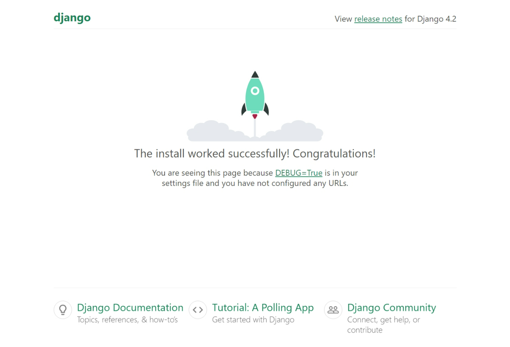
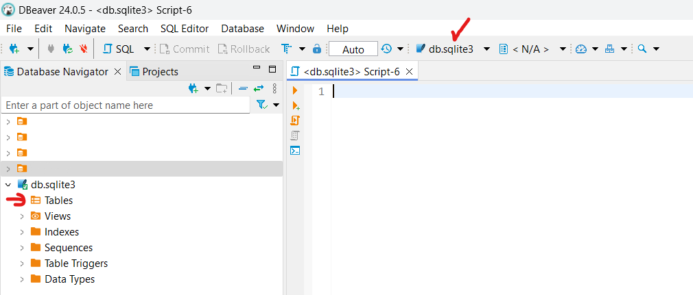
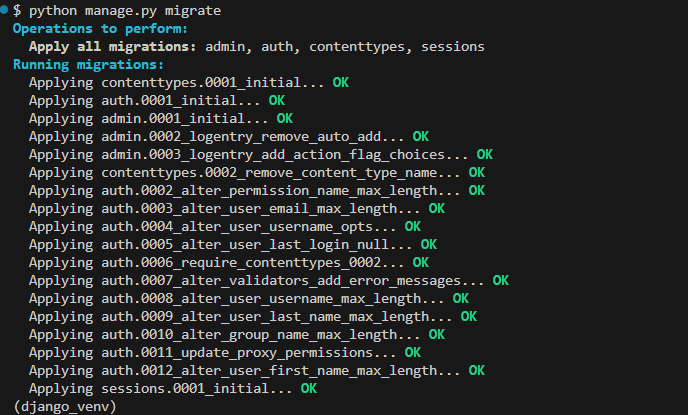
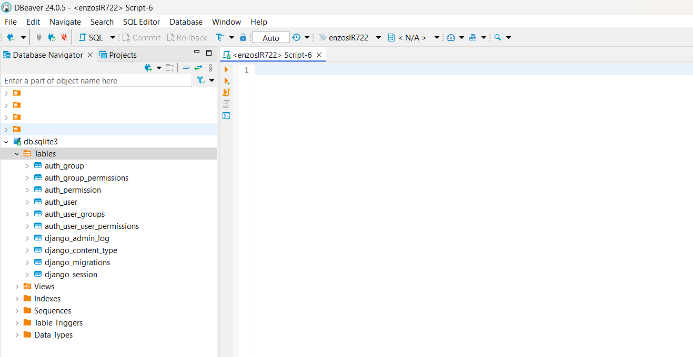
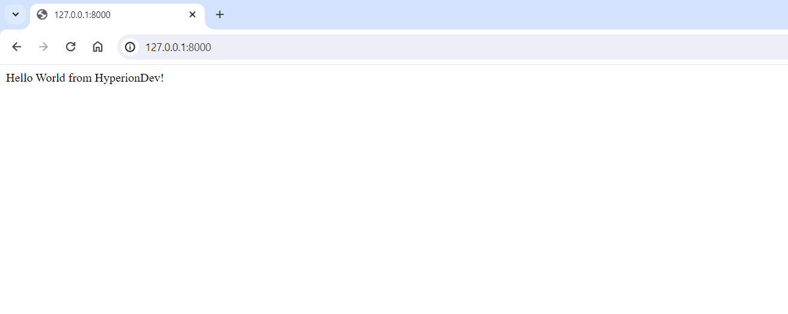

# Django 2: Practical

## Prerequisites

In this practical we will be using VS Code. But you are free to use any IDE of your choice. Please follow this [link](https://code.visualstudio.com/docs/python/tutorial-django#_prerequisites) for the VS Code prerequisites. 

### Python Setup

- Check if **Python** is installed: 

```bash
python --version
```

- Check if **pip** is installed:
```bash
pip --version
```

- Check if **venv** is installed:
```bash
pip --freeze
```

and look for :
```bash
virtualenv==x.x.x
```

### Django Setup
- Create a folder called **django_project** (or anything you want)
- In that folder, use the following command (as appropriate to your computer) to create a virtual environment named .venv based on your current interpreter:

```verbatim
# Linux
sudo apt-get install python3-venv    # If needed
python3 -m venv .django_venv
source .venv/bin/activate

# macOS
python3 -m venv .django_venv
source .venv/bin/activate

# Windows
py -m venv .django_venv
.venv\scripts\activate
```

Once activated, your terminal prompt should look like this:
```bash
(django_venv) -> C:/
```

Now you can install **Django**: 

```bash
pip install django
```

Now we are finally ready to start our project.

## 1. Start the Project

Below are the step-by-step instructions to create a Django project named **django_project** and an application named **crud_app**. We'll do this in stages, ensuring we can test each part using the development server.

### Hello Hyperion! Project and Application Initialisation 

#### 1.1 Create the Project

Open your terminal and navigate to the above created folder named **django_project/**.
- Make sure that you are inside the correct project env, ie. django_venv
- Move to the folder where you want your project files to be created in. I will stay in **django_project/**
- This startproject command assumes (by use of . at the end) that the current folder is your project folder. Start the project initialisation with the below:
```bash 
django-admin startproject django_project .
```
- You should see a new folder ```django_project``` and a file ```manage.py```

#### 1.2 Test the installation

1. To verify the Django project, make sure your virtual environment is activated, then start Django's development server using the command ```python manage.py runserver```. The server runs on the default port ```8000```, and you see output like the following output in the terminal window

```verbatim
Watching for file changes with StatReloader
Performing system checks...

System check identified no issues (0 silenced).

You have 18 unapplied migration(s). Your project may not work properly until you apply the migrations for app(s): admin, auth, contenttypes, sessions.
Run 'python manage.py migrate' to apply them.
May 21, 2024 - 10:54:25
Django version 5.0.6, using settings 'django_project.settings'
Starting development server at http://127.0.0.1:8000/
Quit the server with CTRL-BREAK.
```

2. ```Ctrl+click``` the http://127.0.0.1:8000/ URL in the terminal output window to open your default browser to that address. If Django is installed correctly and the project is valid, you see the default page shown below. The VS Code terminal output window also shows the server log. Once run you ```db.sqlite3``` will also be generated.

3. Alternatively, open your internet browser window and put in ```http://127.0.0.1:8000/``` or ```http://localhost:8000/```. You should have something like:



4. When you're done, close the browser window and stop the server in VS Code using Ctrl+C as indicated in the terminal output window.

5. You will notice that there warning message from the terminal mentioned ```You have 18 unapplied migration(s). Your project may not work properly until you apply the migrations for app(s): admin, auth, contenttypes, sessions.```. If you explore the generated ```db.sqlite3``` in [DBeaver Community Edition](https://dbeaver.io/download/) or any other database management software, you would see that there are no tables. The message above mean that there are pending changing to be persisted. 


6. There we need to migrate the data to the database by doing ```python manage.py migrate``` then we get this:
From the terminal:

From Dbeaver:


#### 1.3 Create an app: Hello World from HyperionDev!

In this step, we wil create a simple page that will display ```Hello World from HyperionDev!```. 

1. In the VS Code Terminal with your virtual environment activated, run the administrative utility's startapp command in your project folder (where manage.py resides):

```bash
    python manage.py startapp crud_app
``` 

We will modify 3 files here:
- ```crud_app/views.py```
- ```crud_app/urls.py``` (To be created by ourselves.)
- ```django_project/urls.py```

The command creates a folder called ```crud_app``` that contains a number of code files and one subfolder. Of these, you frequently work with ```views.py``` (that contains the functions that define pages in your web app) and ```models.py``` (that contains classes defining your data objects). The migrations folder is used by Django's administrative utility to manage database versions. There are also the files ```apps.py``` (app configuration), ```admin.py``` (for creating an administrative interface), and ```tests.py``` (for creating tests), which are not covered here.

2. Modify ```crud_app/views.py``` to match the following code, which creates a single view for the app's home page:

```python
from django.http import HttpResponse

def home(request):
    return HttpResponse("Hello World from HyperionDev!")
```

3. Create a file, ```crud_app/urls.py```, with the contents below. The urls.py file is where you specify patterns to route different URLs to their appropriate views. The code below contains one route to map root URL of the app ("") to the views.home function that you just added to ```crud_app/views.py```:

```python
from django.urls import path
from crud_app import views

urlpatterns = [
    path("", views.home, name="home"),
]
```

4. The ```django_project``` folder also contains a ```urls.py file```, which is where URL routing is actually handled. Open ```django_project/urls.py``` and modify it to match the following code (you can retain the instructive comments if you like). This code pulls in the app's ```crud_app/urls.py``` using ```django.urls.include```, which keeps the app's routes contained within the app. This separation is helpful when a project contains multiple apps.

```python
from django.contrib import admin
from django.urls import include, path

urlpatterns = [
    path("", include("crud_app.urls")),
    path('admin/', admin.site.urls)
]
```

5. Save all modified files.

6. In the VS Code Terminal, again with the virtual environment activated, run the development server with python manage.py runserver and open a browser to ```http://127.0.0.1:8000/``` to see a page that renders ```Hello World from HyperionDev!```.

You should see: 




#### 1.4 Rendering from Template

The app we've created so far in this practical generates only plain text web pages from Python code. A much better practice is to keep HTML out of your code entirely by using ```templates```, so that your code is concerned only with data values and not with rendering. In Django, a template is an HTML file that contains placeholders for values that the code provides at run time. The Django templating engine then takes care of making the substitutions when rendering the page.

1. In `crud_app/urls.py`, add a route to the urlpatterns list:

```python
path("crud_app/<name>", views.sample_test, name="sample_test_page"),
```

The first argument to path defines a route `crud_app/` that accepts a variable string called `name`. The string is passed to the `views.sample_test` function specified in the second argument to path.

URL routes are case-sensitive. For example, the route `/crud_app/<name>` is distinct from `/Crud_app/<name>`. If you want the same view function to handle both, define paths for each variant.

2. Add the content below in `crud_app/views.py` with the following code to define the `sample_test` function:

```python
from django.shortcuts import render
from django.http import HttpResponse
from django.utils.timezone import datetime
import re

def sample_test(request, name):
    print(request.build_absolute_uri()) #optional
    return render(
        request,
        'crud_app/sample_test.html',
        {
            'name': name,
            'date': datetime.now(),
            'unit': 'hyperionDev'
        }
    )
```

The `name` variable defined in the URL route is given as an argument to the `sample_test` function. 

3. We start by creating a single page using a template. In subsequent sections, we will configure the app to serve static files and then create multiple pages to the app that each contains a nav bar from a base template. 

4. In the ```django_project/settings.py``` file, locate the ```INSTALLED_APPS``` list and add the following entry, which makes sure the project knows about the app so it can handle templating:

```python
INSTALLED_APPS = [
    'django.contrib.admin',
    'django.contrib.auth',
    'django.contrib.contenttypes',
    'django.contrib.sessions',
    'django.contrib.messages',
    'django.contrib.staticfiles',
    'crud_app'  # <- Newly created app added here! 
]
```

5. Inside the ```crud_app``` folder, create a folder named ```templates```, and then another subfolder named ```crud_app``` to match the app name (this two-tiered folder structure is typical Django convention).

6. In the ```templates/crud_app``` folder, create a file named ```sample_test.html``` with the contents below. This template contains two placeholders for data values named `name`, and `date`, which are delineated by pairs of curly braces, `{{` and `}}`. All other invariant text is part of the template, along with formatting markup (such as `<strong>`). As you can see, template placeholders can also include formatting, the expressions after the pipe `|` symbols, in this case using Django's built-in [date filter](https://docs.djangoproject.com/en/5.0/ref/templates/builtins/#date) and [time](https://docs.djangoproject.com/en/5.0/ref/templates/builtins/#time) filter. The code, then needs only to pass the datetime value rather than a pre-formatted string:

```html
<!DOCTYPE html>
<html>
    <head>
        <meta charset="utf-8" />
        <title>Hello World from HyperionDev!</title>
    </head>
    <body>
        <strong>Hello there, {{ name }}!</strong> It's {{ date | date:"l, d F, Y" }} at {{ date | time:"H:i:s" }}
    </body>
</html>
```

7. At the top of views.py, add the following import statement:

```python
from django.shortcuts import render
```

8. As defined earlier, the file `crud_app/views.py`, the `sample_test` function uses django.shortcuts.render method to load a template and to provide the template context. The context is the set of variables for use within the template. The render function takes the request object, followed by the path to to the template relative to the templates folder, then the context object. (Developers typically name the templates the same as the functions that use them, but matching names are not required because you always refer to the exact filename in your code.)


```python
def sample_test(request, name):
    print(request.build_absolute_uri()) #optional
    return render(
        request,
        'crud_app/sample_test.html',
        {
            'name': name,
            'date': datetime.now(),
            'unit': 'hyperionDev'
        }
    )
```
9. In the VS Code Terminal, again with the virtual environment activated, run the development server with python manage.py runserver and open a browser to `http://127.0.0.1:8000/`. `Hello World from HyperionDev!` should be rendered as before. To activate our newly created page, with the server still running, in the browser enter `http://127.0.0.1:8000/crud_app/HyperionDev`. We have used a different routing rule than the previous one. 


## 2. Experience with models and migrations

We will start a branch new project and build a simple form that takes in data, stores it in the database and gets retrieved when needed. 

The information about a user that will be collected from the form is:
 - Name
 - Photo
 - Email
 - Password
 - Mobile Number
 - Date of birth

There will be 5 page actions from the user:
 - Adding a user
 - Deleting a user
 - Editing a user's details
 - Viewing a user's detail
 - Listing all the users (Main page)
        

Some steps will be assusmed:
 - python, pip are installed,
 - A virtual environment is installed (`django_venv` for example),
 - django is installed in the virtual environment

Now let's repeat the steps above:


## Basics
 1. Activate your virtual environment
 2. Run from the terminal : `django-admin startproject django_project .` Check for `manage.py` and `django_project` folder.
 3. Create `db.sqlite3` by running: `python manage.py migrate`
 4. Connect `db.sqlite3` to DBeaver for tracking
 5. Run the server with: `python manage.py runserver`
 6. Stop the server with `ctrl + c` on the terminal
7. Create an app called `register_app` with: `python manage.py startapp register_app`. Check for `register_app` folder.
8. In `\django_project\settings.py` the `register_app` to django's set of installed apps list `INSTALLED_APPS`. 
9. In `\django_project\settings.py`, check if `django.contrib.staticfiles` is present. 


## Hello World!
10.  In `register_app\views.py`, add the function `hello`
```python
from django.shortcuts import render
from django.http import HttpResponse
def hello(request):
    return HttpResponse("Hello, from Hyperion!")
```
11.  In `register_app\urls`, add the variable `urlpatterns`. Create if do not exist.
```python
from django.urls import path
from register_app import views

urlpatterns = [
    path("hello/", views.hello, name="hello"),
]
```
11. In `django_project\urls`, add  `urlpatterns`
```python
from django.contrib import admin
from django.urls import include, path

urlpatterns = [
    path('admin/', admin.site.urls),
    path("", include("register_app.urls")),
]
```
## Static files location
12. In `django_project\urls`, add `from django.contrib.staticfiles.urls import staticfiles_urlpatterns` on top, and `urlpatterns += staticfiles_urlpatterns()` after the current set of urls. That is for `.css` and other types of files.

## Forms
We will be creating the Django form that will be responsible of collecting the user's information.
13. In `register_app\forms.py` add the required fields, in the created form class `UserForm`

## Models
Now that we have the forms, let's create the models correcponding tht forms.
14. In `register_app\models.py` add the `User` model.
15. New model added, then we need to acknoledge the changes with `python manage.py makemigrations`
python manage.py migrate
16. Open DBeaver, and look for the table `register_app_user`. Then, you do `SELECT * FROM register_app_user`

## Views
Now we need to create views. Functions that are the responsible to link the models and the HTML pages, the templates.
17. In `register_app\views.py` add, the functions `add_user` and `user_list`. 
18. In `register_app\urls`, add the variable `urlpatterns`. Create if do not exist.
```python
from django.urls import path
from register_app import views

urlpatterns = [
    path("", views.user_list, name = "home"),
    path("hello/", views.hello, name = "hello"),
    path('add/', views.add_user, name = "add"),
]
```

## Templates
Now we need to create the html pages for those actions. 
19. In `register_app` create a folder named `templates`.
20. In `register_app\templates` create a folder named `register_app`. (Blame it on Django)

## Final Verification
21. Run the server with: `python manage.py runserver`
22. Open the page on the browser: `http://127.0.0.1:8000/`
23. Click on `Add User`.
24. Add a user and save. 
25. Check your data in DBeaver. 
26. Enjoy the rest! 
