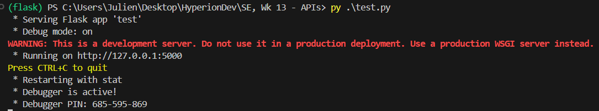
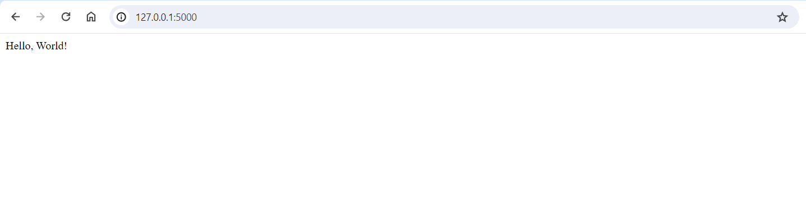
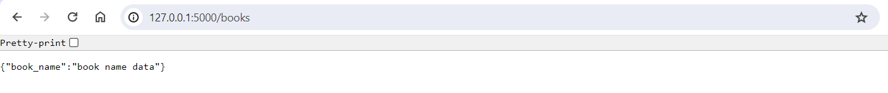
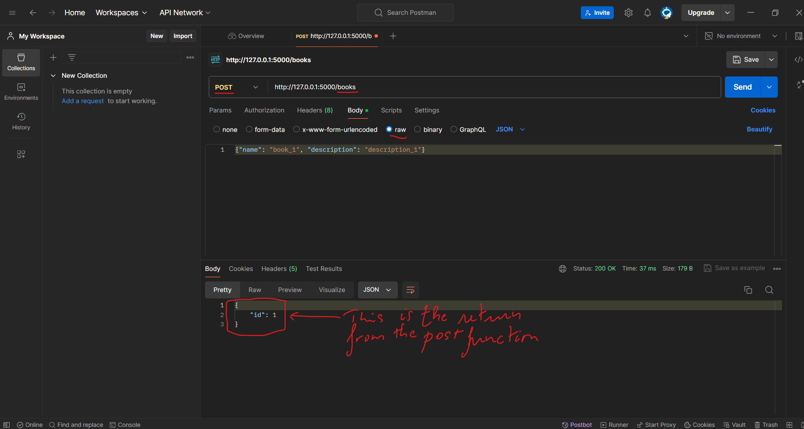

# HyperionDev - Lecture - APIs

This is the supporting material for our API lecture. 

## Softwares to install

- [Postman](https://www.postman.com/downloads/)
- [DBeaver Community Edition](https://dbeaver.io/download/)

## Python Setup

- Check if **Python** is installed: 

```bash
python --version
```

- Check if **pip** is installed:
```bash
pip --version
```

- Check if **venv** is installed:
```bash
pip --freeze
```

and look for :
```bash
virtualenv==x.x.x
```

## Flash Project Setup and new Python virtual environment

Use the following command (as appropriate to your Operating System) to create a virtual environment named `flask_venv` based on your current interpreter:

```verbatim
# Linux
sudo apt-get install python3-venv    # If needed
python3 -m venv flask_venv
source .venv/bin/activate

# macOS
python3 -m venv flask_venv
source .venv/bin/activate

# Windows
py -m venv flask_venv
.venv\scripts\activate
```

Once activated, your terminal prompt should look like this:
```bash
(flask_venv) -> C:/
```

## Packages to install with pip

Using ``` pip install ``` install the following packages:

- request
- flask_sqlalchemy
- flask

or just do ```pip install -r requirements.txt```. 

The `requirements.txt` is provided and should be in the same directory as the project.


## Create a minimalistic Hello Word, the Flask way

As opposed to Django, Flask requires less code to get started. Some may even look at it as easy. It is true but you would need to structure your application yourself. When you write this piece of code, and run it, this is your server running. 

You can create a python file called `flask_app.py` and store the code below in it. 

```python	
from flask import Flask

app = Flask(__name__)

@app.route("/") # <--- Default route
def hello_world():
    return "<p>Hello, World!</p>"

if __name__ == '__main__':
    app.run(debug=True) # <--- This allows you to make changes while the app is running. Not good for production.
```

From the terminal, you will run the following `py flask_app.py`. From the terminal, you should see appear:


This server has the following parameters: url: `http://127.0.0.1` with port: `5000`.



## Dealing with REST

REST API would use a 
- `GET` request to retrieve a record,
- `POST` request creates a new record
- `PUT` request updates a record, 
- `DELETE` request deletes one.

To deal use those methods, there is a need for an address or API endpoint.

API endpoints are the URLs that your API clients will use to interact with your application. In Flask, you can define endpoints using route [decorators](https://www.geeksforgeeks.org/decorators-in-python/). 

To make our minimalistic code [Minimalistic Flask](#create-a-minimalistic-Hello-Word-the-Flask-way) a RESTful API, we will add routes, aka API endpoints, and functions. [Routing](https://www.geeksforgeeks.org/flask-app-routing/) is means mapping the URLs to a specific function that will handle the logic for that URL.

### Response types

When building a Flask API, the response type for a function route is typically a dictionary. Flask automatically converts this dictionary into a JSON response when it is returned from a route function. This conversion is convenient as it allows you to work with Python dictionaries, which are easily understood and manipulated, while still adhering to the JSON format expected in API communications.

```python
payload = {"name": "foo", "description": "bar"}
```

Sometimes the dictionaries may not work as expected, then there will be a need to forcefully convert that dictionary into a JSON response by using a function call ``dumps` from the `json` module.

### GET

Use GET requests to retrieve resource representation/information only – and not modify it in any way. As GET requests do not change the resource’s state, these are said to be safe methods. More information about get found [here](https://restfulapi.net/http-methods/#get)

To apply it to our application, we can add the following endpoint:

```python	
@app.route("/books", methods=['GET']) # <--- Default route
def get_books():
    return {"book_name": "book name data"}
```
After running the application, go to the browser and navigate to the server `http://localhost:5000/books`. Note that the initial URL contains the newly created endpoint `/books`. Please do not append an extra `/`. The resulting page is as follows:


One thing to note about about the `methods` keyword in the decorator is that, for `GET` it is not necessary to provide it. 

To make this exercise a bit more realistic, we will create a database that will be used to create, store and retrieve books. That will all be done through the API endpoints we will create. To do so we will need to provide a model. 

### Create a Book Model
As we have done in our [Django Example](https://github.com/skills-cogrammar/C7-Lecture-Backpack/blob/main/2%20-%20Software%20Engineering%20(SE)/Week%2011/1%20-%20Theory%20and%20Practical/3%20-%20Wednesday/Practical/app/models.py) we have defined a model in a `class`. We will do the same with Flask. 

In the same file `flask_app.py`, add the following model:

```python	
class Book(db.Model):
    id = db.Column(db.Integer,primary_key=True)
    name = db.Column(db.String(80), unique=True, nullable=False)
    description = db.Column(db.String(120))

    def __repr__(self):
        return f"Book name: {self.name} with description: {self.description}"
```
As you can see, this will result in an error. That inheritance of the `db.Model` does not exist because we have not imported it. That `db` variable is of type `SQLAlchemy`. The following need to be prepended to the above code, so that we don't have any issues with the code.

```python
from flask import Flask
from flask_sqlalchemy import SQLAlchemy

app = Flask(__name__)
# The database connection URI used for the default engine. It can be either a string or a SQLAlchemy URL instance.
app.config['SQLALCHEMY_DATABASE_URI'] = 'sqlite:///book_store.sqlite3'
db = SQLAlchemy(app)
```
The code should run successfully, and database `book_store.sqlite3` will be  available in a folder named `instance` will be created. That is where the SQLite database will be stored. One important note here is about `migrations`. The migrations, or update of the database is done automatically. When that folder `instance` is created, the database is not automatically with it. You need add the following:

```python
with app.app_context():
    db.create_all()
```
> [!WARNING]  
> These 2 lines must be placed under the all models created.

Once the above migrations are done, the database will be automatically be created, along with the table(s).

### POST

Use POST APIs to create new subordinate resources, e.g., a file is subordinate to a directory containing it or a row is subordinate to a database table. More information about get found [here](https://restfulapi.net/http-methods/#post)

To apply it to our application, we can add the following endpoint:

```python	
@app.route("/books", methods=["POST"])
def add_book():
    book = Book(name=request.json["name"], description=request.json["description"])
    db.session.add(book)
    db.session.commit()
    return {"id":book.id}
```
This is a real API endpoint that only works either with the some applications like Postman or curl, or with Python `requests`. It can't directly work with the web browser. Once this is implemented, and the server running. We can do the following:

In Postman:
- Create a new `HTTP` type of requests
- Choose `POST` 
- Next to `POST`, in the blank field, put in `http://localhost:5000/books`. Because it is having the POST method, it won't run the `GET`
- Below, you look for `body`, then `raw`. An put in the following payload:
    `{"name": "book_1", "description": "description_1"}`
The image below represents the outcome:



