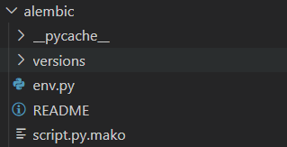
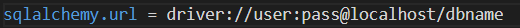
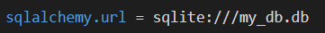
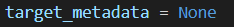
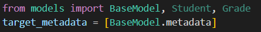
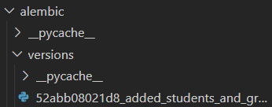

## Alembic Migrations

This is a guide on how to perform migrations using alembic alongside SQLAlchemy.

- First make sure that you have already created a virtual environment. If not you can use the following command:<br>
```python -m venv venv_name```

- Now that we have a virtual environment we can install alembic:<br>
```pip install alembic```

- You can test for a successfull install by using:<br>
```alembic --version```

- The first thing we have to do when using alembic is to initialise a migrations environment. We cna use the following command for that:<br>
```alembic init alembic```

- This will create a migrations folder called alembic.<br>


- You will alse see a file called alembic.ini appear:<br>


Now that we have all our evironment initialised we have to add some information into our environment for alembic to know what to migrate.

- We first have to fo into our alembic.ini file to set the path/url for our database. We can do this by setting the value of sqlalchemy.url.<br>
<br>
 :arrow_down: <br>


Now that we have the correct driver setup we have to go to 'alembic/env.py'
- We will be editing our `target_metadata` variable<br>

- We need to add our models metadata to env.py.
- To do this we first have to import our models

- After importing the model we want to migrate we have to add `BaseModel.metadata` to the `target_metadata`. 
- Notice that we have added this into a list and not just the metadata only.
- Another thing to notice is that we have imported all our models but only added the Basemodel's metadata to `target_metadata`. This is because alembic still needs our other models imported to know whick database tables to create and edit.

After we have set all our values in our environment we can now create a migration.
- To create a migration we can use the following command<br>
`alembic revision --autogenerate -m "YOUR COMMENT"`
- This will create a new migration file inside 'alembic/version/'<br>


## We are almost there!

- We now have our migrations file and the only thing left to do is perform the migration. To do this we can call the following command<br>
`alembic upgrade head`


