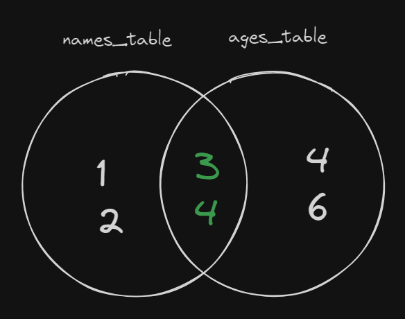
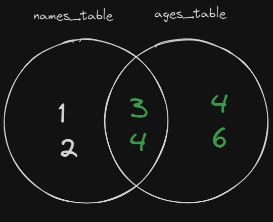
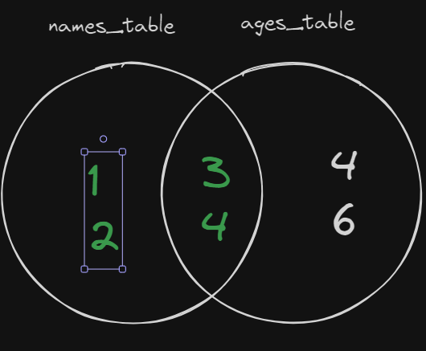
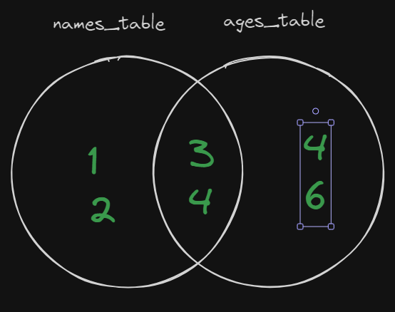

# Chapter 8 Persistent Storage 

## 8.1 Introduction 
Data is a key part of what we do as software engineers and data scientists, having a way to store this data beyond a single session is really important.

For software engineers, storing data allows us to build custom experiences for users and also makes it possible for different systems to work together. As a data scientist, your job would be impossible without persistent data as not all analysis processes can be done in real-time, historic data is very important.

In this chapter, we will take a look at how we can work with persistent data in our work, we will be using the analogy of a social media platform to describe the different things.

## 8.1.1 Story Time 
If you think of a social media platform like Facebook, you can image all of the data that flows through it, from obvious data like posts, user details to less obvious data like system logs and telemetry data.

Throughout this chapter we will reference back to how a social media platform might work with data to give you a better understanding of the different concepts.

## 8.2 Types of Data 
Before we can look at how we can store data, we need to know about the types of data that we might encounter, this knowledge is important as it allows us to make better choices in the future about how we can store the data.

### 8.2.1 Master Data 
Master data can be seen as a central point of truth for an organisation, key business data is stored as master data, this includes data from all departments, internal business details and key details from their services.

If we look at master data in the context of a social media platform, this might be information about the company itself, like the current employees and their details, but this would also include information about their platform users and any other internal and external data that relates to the business.

Master data usually doesn’t change too much, for the most part, master data is data that isn’t frequently changing, and isn’t frequently added or removed.
### 8.2.2 Transactional Data
Transactional data is data that’s stored on a specific high-velocity operation, this data is constantly being read, created, updated and deleted. Transactional data is the most common type of data that someone working in software engineering would encounter.

For a social media platform, this information would data about posts that are being made, it can also include system-level data like error logs, telemetry and any other for of data that is constantly being generated.

### 8.2.3 Analytical Data 
Analytical data is data that serves the purpose of getting key business insight, this is the type of data that data scientists use for their analysis and making business decisions.

Similar to master data, analytical data takes data from every corner of the organisation, but the key difference between the two is that master data cares about the most up to date information where analytical data cares about current and historical data.

Analytical data is high velocity like transactional data, but is concerned with having data written and read but not frequently being deleted. 

In the context of a social media platform, analytical data can be data about daily posts, daily network performance metrics and anything else that can be used for analysis.


### 8.2.4 Freeform Data 
Freeform data is any data that comes in non-standard formats, this can be anything from media files like images, music and videos, but it can also be data like emails, documents and physical material like books.

On a social media platform, this can be seen in the form of images, videos and other pieces of media


## 8.3 Data Formats 
As we saw, we have a few different types of data, with these different types of data, we would need to make sure that they are stored correctly so that we can get the best out of them.

Understanding the different formats and how they can work with the type of data we have is important as it allows us to make good decisions about storage. A common trap that people find themselves in is trying to fit all of their data into a single database solution.

### 8.3.1 Structured Data 
Structured data follows a predefined structure, this structure is easy for people and computers to understand. The rules around structured data will be set by the person creating the data and the rules will be enforced by the system where the data is being stored.

Structured data is a must if you are storing master data and analytical data as it ensures that the data is standard and will not have any inconsistencies (excluding incorrectly entered data).

Transactional data is also commonly stored in structured formats depending on the types of transactions that are being performed, if you were building a banking application, it would be very important to make sure that the data that is being used has good integrity, so using a structured format would be very important in a situation like this.

#### 8.3.1.1 ACID 
A common standard for structured data solutions is ACID, which stands for Atomicity. Consistency, Isolation and Durability. ACID lays our a few rules that a database solution should follow to ensure the consistency of database transactions.

**Atomicity**
- Transactions are treated as a single unit
- Either all operations are completed successfully, or none of them are completed 
- If there is a failure, the entire operation will be rolledback and not changes will be stored

**Consistency**
- Ensures that data moves from one valid state to another based on a predefined business rule.

**Isolation**
- Prevents operations from interfering with one another 
- If there are multiple operations happening on the same data, the system ensures that the data remains consistent for all process to be completed successfully 

**Durability**
- Once a transaction has been completed, all of the changes are permanent and persist even if the system crashes

### 8.3.2 Semi-Structured Data 
Semi-structured does not follow any strict rules on a system level allowing for more fluid transactions, if there is a need for structure, it will be up to the people working with the database solution to enforce these rules on their own. 

Semi-structured data is good for a lot of operations that might require a transfer of data between systems, this makes it another good choice for transactional operations.

In the context of a social media platform, a semi-structure form of data might be a single post, the data required for the different types of post might change, if someone is posting just text content, there is no need to include a field for media when the post is being sent out and so on.

### 8.3.3 Unstructured Data 
Unstructured data is any form of that that can not have a fixed structure imposed on it. This type of data will usually come in the form of documents, media and other artefacts.

Freeform data will always need to be stored as unstructured data. In the context of a social media platform, we would have unstructured data like images, videos and audio.


## 8.4 Storage Solutions 
Since we have a few different ways that we can store our data, it comes at no surprise that we have a few options when it comes to how we can store our data. Below are a few (not all) ways that we can store the different types of data.

**Structured**
- Tabular 
- Columnar 

**Semi-structured**
- Document 
- Objects 
- Graph

**Unstructured**
- Blob (Binary Large Objects)

### 8.4.1 Storage Options
**Structured**
- SQL Server
- PostgreSQL 
- Snowflake 

**Semi-structured**
- MongoDB 
- Firebase/firestore
- neo4j
- Redis

**Unstructured**
- Microsoft blob storage 
- Amazon s3
- Google Cloud Storage

## 8.5 Querying Data
Having our data stored is the first problem, but once that has been taken care of, how can we manage our data?

When it comes to semi-structured and unstructured data, our interactions with our data are dependent on the platform and tools that we choose, so there is no standardised, on size fits all approach, though JSON is one of the most popular approaches for many semi-structured database tools.

When we take a look at structured data on the other hand, SQL is the stand-out choice. Any tool that claims to use SQL needs to adhere to the fundamental principles of SQL which ensure that a majority of operations remain consistent regardless of the choice of tool, this makes it easy to move between platforms without having to completely relearning everything.

For the rest of this chapter, we will focus on gaining an understanding of how to work with SQL and perform some basic operations.

## 8.6 SQL Statement Categories 
SQL has a lot of different commands for performing different operations, these different types of statements are usually broken up into their own categories so that we know what a set of commands are responsible for.

The code examples below will make use of PostgreSQL syntax, most of the commands will apply to all flavours of SQL, but the ones that don't will be highlighted.

### 8.6.1 Data Definition Language (DDL)
These commands are use for defining the database schema, these commands can be seen more as structural commands.

| Command | Description                                                                                                         | Syntax                        |
| ------- | ------------------------------------------------------------------------------------------------------------------- | ----------------------------- |
| CREATE  | Create tables and other database structures used for working with tables (functions, views, stored procedures, etc) | CREATE TABLE table_name (...) |
| DROP    | Delete a database table or object                                                                                   | DROP TABLE table_name         |
| ALTER   | Updates the schema of our table                                                                                     | ALTER TABLE table_name ...    |

#### 8.6.1.1 CREATE
**CREATE TABLE**
When creating tables, it's important to know the different data types that are part of the flavour of SQL that you are working with, a quick google search on the data types for said flavour should be helpful, but [here](https://www.w3schools.com/sql/sql_datatypes.asp) is a link to some of the most common data flavours.

```SQL 
CREATE TABLE account(
	-- SERIAL is postgres specific for generating auto incrementing IDs
	id SERIAL PRIMARY KEY,
	first_name VARCHAR(60) NOT NULL,
	last_name VARCHAR(60) NOT NULL,
	username VARCHAR(30) NOT NULL UNIQUE,
	active BOOLEAN DEFAULT true -- BOOLEAN is postgres specific
) 
```
- Each table needs a unique field for identifying values, this is known as a primary key.
	- Primary keys are NOT NULL by default 
- We can add constraints to each field, the `NOT NULL` will ensure that an error is thrown if the field is left out when inserting data 
- We can use the `DEFAULT` constraint to set a default value if we choose to leave out a field when inserting.
- We can use the `UNIQUE` to state that this field should only have 1 instance of a specific value.

**OTHER CREATES**
We can use the create statement to create more than just tables, we can create more advanced things like views, triggers, stored procedures and more, but for having a basic understanding of SQL, those things will not be covered. 

However, we will cover one other use case of the `CREATE`, this is for creating databases.

```SQL 
CREATE DATABASE social_media;
```

#### 8.6.1.2 DROP TABLE 
This statement is used for deleting a database and all of the data that is within it. There are a few prerequisites before using this command, for example, you need to make sure that the table you are deleting does not have any dependent tables, if one of your fields is being used as a foreign key in another table, you would need to drop the dependent table first.

```SQL
DROP TABLE account;
```

We can also use the `DROP` command to drop a database 
```SQL
DROP DATABASE social_media;
```


#### 8.6.1.2 ALTER TABLE 
This statement is useful when we want to make changes to the schema of our table allowing us to modify existing fields, add new fields or remove fields.

```sql
ALTER TABLE account
ADD password varchar(255);
```

```sql 
ALTER TABLE Customers  
RENAME COLUMN password to password_hash;
```

```sql
ALTER TABLE Customers  
DROP COLUMN password;
```


### 8.6.2 Data Manipulation Language (DML)
These are the statements that we use when we are manipulating the data in our tables, we use the statements for inserting, updating and deleting values.

| Command | Description                             | Syntax                           |
| ------- | --------------------------------------- | -------------------------------- |
| INSERT  | Adds data to a table                    | INSERT INTO .. VALUES ...        |
| UPDATE  | Updates the values in an existing table | UPDATE table_name SET ...        |
| DELETE  | Removes values from a table             | DELETE FROM table_name WHERE ... |

#### 8.6.2.1 INSERT
```sql
INSERT INTO account VALUES ('Jack', 'Smith', 'jack_smith'),
('Jim', 'Johnson', 'jimmy_johnson');
```
- We can insert without specifying the fields, the values will be inserted based on the order of our `CREATE TABLE`
- We can insert multiple values by using a comma between each record, the last record will need to have the `;`
- We don't need to insert values for the `id` since it will autofill, and we don't need to insert values for the `active` since it has a default value.
- All strings need to be written using the single quotation `'` 

```sql
INSERT INTO account (last_name, first_name, active, username) 
VALUES ('turner', 'timmy', 0, 'timmy_turner')
```
- We can explicitly state the fields that we will be inserting 
- For inserting boolean values, we can use 0 for false and 1 for true.

#### 8.6.2.2 UPDATE 
```sql 
UPDATE account 
SET first_name = 'Timmy'
WHERE first_name = 'timmy'
```
- We use the `WHERE`clause to determine which fields we would like to change, 
- If you know the primary key of the record you want to update, it's best to us that to avoid changing too many records at once.

```sql
UPDATE account 
SET first_name = 'Timmy',
	last_name = 'Turner'
WHERE first_name = 'timmy'
```
- We can update more than one field at a time by adding a comma after the first field and adding the details of the other field/s

```sql
UPDATE account 
SET first_name = 'Timmy'
```
- We can change the value of every value in the table if we don't state the `WHERE` clause.
- It's important to make sure that you confirm that you are updating the correct things before running your scripts because there is no going back.

#### 8.6.2.3 DELETE
```sql
DELETE FROM account 
WHERE first_name = 'Timmy'
```
- We can only delete an entire record
- We use the `WHERE` clause to delete records that have specific values 
- If you want to delete a specific record, it's best to use a unique field to prevent deleting values that you don't want to delete 

```sql
DELETE FROM account
```
- This would delete all of the records in our table.

### 8.6.3 Data Query Language (DQL)
This is the most common category that you will work with, these statements allow you to get data from your tables, we will take a deeper look at these statements section 8.7

| Command | Description                                 | Syntax            |
| ------- | ------------------------------------------- | ----------------- |
| SELECT  | Retrieves data from a table or a few tables | SELECT * FROM ... |
```sql 
SELECT *
FROM account
```
- We can use the `*` to get all of the columns in our table 
- We need to state the table that we are querying using the `FROM` clause

```sql
SELECT first_name, last_name
FROM account
WHERE active = true
```
- We can select the columns that we want to view in the `SELECT` clause 
- We can use the `WHERE` clause to filter the results of our search

### 8.6.4 Data Control Language (DCL)
These commands are used for manging the access to different aspects of our database. The commands are typically used by database admins and are important for the security of the database.

| Command | Description                                                                                                                              | Syntax            |
| ------- | ---------------------------------------------------------------------------------------------------------------------------------------- | ----------------- |
| GRANT   | Provides privileges to users and roles allowing them to perform certain operations and providing them access to certain database objects | GRANT name ON ... |
| REVOKE  | Removes previous privileges from users and roles                                                                                         | REVOKE .. ON ...  |

*NOTE: Look into how the flavour of SQL you are using handles these operations*
```sql
CREATE ROLE jimmy WITH LOGIN PASSWORD 'thisisastrongpassword' INHERIT;

CREATE ROLE dev WITH NOLOGIN NOINHERIT;
```
- We can use the `CREATE ROLE` statement to create a new database user 
	- Roles can be individuals who will have access to the database 
	- Roles can also be a group of users who share certain permissions 
	- Roles are important to for managing who can do what with the database
- In Postgres (maybe other flavours as well), we can use a few keywords when creating our roles 
	- `LOGIN` - Creates a role that can be used to connect to an instance of our database, this will usually be used for an individual user or for a system that needs to connect to our database 
	- `NOLOGIN` - Creates a role that can only be used for groups, we add `LOGIN` roles to `NOLOGIN` roles so that they can share access rules 
	- `INHERIT` - Each role can be a member of other roles, the `INHERIT` keyword allows the role to automatically inherit any privileges of the roles they're part of 
	- `NOINHERIT` - The role does not automatically inherit privilege, the privileges need to be manually set.

```sql
GRANT INSERT, SELECT, UPDATE, DELETE ON ALL TABLES IN SCHEMA public TO dev;

GRANT SELECT ON account TO jimmy;
```
- We can use the `GRANT` statement to allow a role access to certain commands
	- We can state the commands that the role has permission to use, any command that is not stated won't be accessible 
- We can select which tables can be accessed using the `ON ALL TABLES` statement
- We can specify individual tables using the `ON table_1, table_2`
- We have to specify the role that is getting the permission using the `TO role` 

```sql
GRANT dev TO jimmy
```
- We can add a LOGIN role to a NOLOGIN roles by using the `GRANT` statement 
- The login role (user role) will inherit all of the privileges of the nologin role, 
- if there are any changes to the nologin role, they will affect all users who are part of this group

```sql
REVOKE DELETE ON ALL TABLES IN SCHEMA public FROM dev;

REVOKE INSERT ON account FROM dev;
```
- We can remove permissions by using the `REVOKE` statement, we will state the commands that we want to limit and the tables this should be applied on.
- We use the `FROM` to state the role that these permissions are being removed from 

### 8.6.5 Transaction Control Language (TCL)

| Command  | Description                                  | Syntax    |
| -------- | -------------------------------------------- | --------- |
| COMMIT   | Saves all changes made during a transaction  | COMMIT;   |
| ROLLBACK | Undoes all changes made during a transaction | ROLLBACK; |

```sql
```


### 8.7 Querying Data In SQL
SQL is probably the most important language to be familiar with, it's not only important for developers and data scientists, but anyone who wants to gain insight from data would significantly gain from having knowledge of SQL. 

Querying data from SQL tables is the most common operations that most people will perform, having a good understanding of it will ensure that you are able to not only get through any coding interview questions, but also use the skills in the work environment.

### 8.7.1 Basic SELECT
As we saw earlier, we can use the `SELECT`, `FROM` and `WHERE` to perform basic lookups on our tables.
```sql
SELECT first_name, last_name 
FROM account 
WHERE active = true;
```


##### SELECT Clause 
The `SELECT` lets us pick the columns that we would like to view the data for, we can select 1 to many columns.

```sql 
SELECT column_one, column_two
FROM table_name;

SELECT *
FROM table_name;

SELECT column_one AS "Column One", column_two AS column2
FROM table_name;
```
- We can select specific columns from our table
- We can select all of the columns using the `*`
- We can Alias our columns using the `AS` 

#### FROM Clause
The `FROM` allows us to choose the tables that we would like to work with, we can not have a `SELECT` statement without a `FROM`, this determines which table/s we want to look at.
```sql
SELECT column_one, column_two
FROM table_name;

SELECT column_one, column_two
FROM table_name, table_two;
```
- We can choose from multiple tables, but we want to avoid doing this.


#### WHERE Clause 
The `WHERE` is used to filter the results of our search. The `WHERE` clause will result in records that match the search criteria being returned. 

It's important to keep in mind that all of these operations can be applied anywhere the `WHERE` clause is used, this can be in a `SELECT`, `UPDATE` or `DELETE` 

```sql 
SELECT *
FROM table_name 
WHERE column_one = 200;

SELECT *
FROM table_name 
WHERE column_two LIKE '%keyword%';

SELECT *
FROM table_name 
WHERE column_one BETWEEN 200 AND 450;

SELECT *
FROM table_name 
WHERE column_one IN (200, 500, 450);

SELECT *
FROM table_name 
WHERE column_one IN (200, 500, 450)
AND column_two LIKE '%keyword%';
```
- We can have a single check 
- We can add more checks by using the `AND` along with the condition that we are checking 

**Comparison Operators**

| Operator | Description               | Example               |
| -------- | ------------------------- | --------------------- |
| =        | Checks for equality       | WHERE column = value  |
| <        | Less than                 | WHERE column < value  |
| >        | Greater than              | WHERE column > value  |
| <>       | Not Equal to (inequality) | WHERE column <> value |

**Common Logical Operators**

| Operator | Description                                                                                                                     | Example                                   |     |
| -------- | ------------------------------------------------------------------------------------------------------------------------------- | ----------------------------------------- | --- |
| AND      | Add more conditions to a statement                                                                                              | WHERE ... `AND` column = value            |     |
| BETWEEN  | Checks if a value is within a given range, we need to use the `AND` to specify the upper and lower bound (values are inclusive) | WHERE value `BETWEEN` min `AND` max       |     |
| IN       | Checks if a value is present in a set of values                                                                                 | WHERE value `IN` (1,2,3,4)                |     |
| NOT      | Checks the opposite of a given statement, this can be used alongside most other logical operators                               | WHERE value `NOT` IN (1,2,3,4)            |     |
| OR       | Checks tow or more conditions, only one of the conditions need to be true                                                       | WHERE value IN (1,2,3,4) `OR` value > 100 |     |
| LIKE     | Checks if a string value contains a certain substring                                                                           | WHERE name LIKE 'Jack'                    |     |
**Working with Strings**
- We can use equality and inequality to look for an exact match 
- String literals in SQL require the use of `'`, `"` is used for calling objects within the database and would result in an error 
We can use the `LIKE` operator to check if a string contains a substring
```sql
...
WHERE name LIKE 'hello'; -- Looks for the exact word 'hello' (case sensitive)

-- Looks for strings ending with 'hello'
-- Expected Output: 'well hello', 'i just came to say hello', 'hello'
WHERE name LIKE '%hello'; 

-- Looks for strings starting with 'hello'
-- Expected Ouput: 'hello world', 'hello from the other side', 'hello' 
WHERE name LIKE 'hello%'; 

-- Looks for strings with 'hello'
-- Expected Ouput: 'hello world', 'well hello there', 'hello' 
WHERE name LIKE '%hello%'; 


-- Looks for exacly `_` characters of any type, and the exact substring after that
-- Expected Output: 'jim', 'kim', 'him', 'sim'
WHERE name LIKE '_im';

-- Expected Output: 'hit', 'him', 'hip'
WHERE name LIKE 'hi_'

-- Expected Output: 'hit', 'him', 'hip', 'kim', 'sim'
WHERE name LIKE '_i_'
```
- We can also combine these two if our search requires it


#### ORDER BY Clause 
We use the `ORDER BY` to change the order that our output will be displayed based on the columns we have selected.

```sql
SELECT column_one, column_two
FROM table_name 
ORDER BY column_one DESC;

SELECT column_one, column_two
FROM table_name 
ORDER BY column_one ASC;

SELECT column_one, column_two
FROM table_name 
ORDER BY column_one ASC, column_two DESC;

```
- We need to determine the column that we will be using to order the output by 
- We can choose one or more columns in our `ORDER BY`
	- If two columns have the same value, they will be compared against the second item added 
	- Each check can be in different orders 
- We can use the `ASC` and `DESC` keywords to determine the order that our values should be sorted 

### 8.7.2 Order of Operations 
Before we go any further, it's important to keep the order that each statement runs in mind when writing our queries, the order of execution and the order we write our statements is not the same.

**Order of execution**
1. FROM + JOIN
3. WHERE 
4. GROUP BY
5. HAVING 
6. SELECT 
7. ORDER BY

There are a few new clauses that we haven't covered in the order above, understanding the order that our code is run is important when it comes with working with some of these clauses. 

#### Aliasing
Aliasing is one of the key things that get affected by the order of execution, we can create aliases in the `SELECT`, `FROM` and `JOIN` clauses, but the order of execution will determine where we can use our aliases.
```sql
SELECT a.first_name AS "First Name", b.balance AS "Last Name"
FROM account AS a, bank AS b
WHERE a.id = b.id
AND first_name <> 'Jimmy'
ORDER BY "FIRST NAME";
```
- We can create aliases in the `SELECT` clause, these will be the headings for the output 
- We can create aliases for the `FROM` clause, these will be used to shorten the names of our tables 
- We can use the `FROM` aliases anywhere in our statement 
	- It's being used in the `SELECT` and `WHERE`
- We can only use the aliases from the `SELECT` in the `ORDER BY` clause 
	- We can't use it in the `WHERE` so we need to use the actual column name.

### 8.7.3 Aggregation
Aggregation is a good way to summarize the data that you have in your table, SQL comes with a few aggregation functions that can be used with the `SELECT` statement.

| Function | Description                                                                                                      | Example                           |
| -------- | ---------------------------------------------------------------------------------------------------------------- | --------------------------------- |
| COUNT    | Counts the number of non-null values in a column, or the total number of records in the table when using the `*` | SELECT `COUNT(names)`<br>FROM ... |
| MIN      | Gets the smallest value in a column (regardless of data)                                                         | SELECT `MIN(age)`<br>FROM ...     |
| MAX      | Gets the largest value in a column (regardless of data type)                                                     | SELECT `MAX(age)`<br>FROM ...     |
| SUM      | Gets the sum of all of the values in a numeric field                                                             | SELECT `SUM(age)`<br>FROM ...     |
| AVG      | Gets the average of the the values in a numeric column                                                           | SELECT `AVG(age)`<br>FROM ...     |
```sql
SELECT COUNT(*) AS "Total People" 
FROM account;

SELECT SUM(age) AS "Total Age"
FROM account

SELECT AVG(age) AS "Average Age"
FROM account;

SELECT MIN(age) AS "Min Age"
FROM account;

SELECT MAX(age) AS "Max Age"
FROM account;
```
- It's good practice to have an alias whenever you do aggregation 


#### GROUP BY Clause 
When you want to select two or more columns when performing aggregation, you need to use the `GROUP BY` clause to aggregate the values according to the values being selected.

Keeping in mind that when we perform aggregation, we get a single value out, grouping the results will allow each group of common values to have their own aggregation. 

Aggregation and GROUP BY is very useful when you would like to summarize specific values in your dataset.

```sql
SELECT release_year, SUM(total_sales) AS "Total Sales by Year"
FROM music 
GROUP BY release_year;

SELECT release_year, release_month, SUM(total_sales) AS "Monthly Sales per Year"
FROM music 
GROUP BY release_year, release_month;
```
- If we have a column in the `SELECT` that is not being aggregated, we have to call it in the `GROUP BY` otherwise we will get an error.


### HAVING clause 
If you take a look at the [order of execution](#order-of-operations) you would notice that the `GROUP BY` comes after the `WHERE` clause, this means that we cannot filter our aggregated values using the `WHERE` clause, this is where the `HAVING` clause come into play, it is basically the `WHERE` for any aggregated value.

```sql
SELECT release_year AS year, SUM(total_sales) AS "Total Sales"
FROM music 
GROUP BY release_year
HAVING SUM(total_sales) < 500;
```
- Notice that we also can't use the alias in the select, this is because `SELECT` comes after the `GROUP BY` and `HAVING` clauses.


### 8.7.3 Joins 
When designing our relational databases, we want to break the tables up as much as we can, this is known as normalization. Database normalization allow us to keep the data in our database consistent as we make changes.

Although we want to store our data in it's normalized form, most of the times, the data that we need will be stored in different tables, a normal select statement wouldn't allow us to get all of the data that we need, this is where joining comes to play.

In SQL, we can use JOINs to combine multiple tables to create a single output allowing us to access the data in it's denormalized form, there are many types of joins, but we will go over the most common types of joins and the ones that you are most likely to come across in an interview.

| Type            | Description                                                                                                                                                |
| --------------- | ---------------------------------------------------------------------------------------------------------------------------------------------------------- |
| CROSS           | (Cartesian join) returns all of the possible combinations of every row in two or more tables                                                               |
| INNER           | returns all of the rows from two tables where the values being joined on match                                                                             |
| FULL OUTER      | Joins all of the values from a left and right table on a specific field, if there are no matching values in either table, the row will contain null values |
| LEFT OUTER JOIN | Returns all of the values in the left table, if there are no matching values in the right table, there will be null values returned                        |
| RIGHT OUTER     | Returns all of the values in the right table, if there are no matching value in the left table, there will be null values returned                         |
| NATURAL         | Joins the tables without the need to explicitly state the field to join the values on                                                                      |


#### Examples 
We can take a look at the following tables to help us visiualise the process that is being performed when we use joins.

names_table

| id  | name |
| --- | ---- |
| 1   | tim  |
| 2   | jim  |
| 3   | kim  |
| 4   | joe  |

ages_table

| id  | age |
| --- | --- |
| 3   | 24  |
| 4   | 25  |
| 5   | 26  |
| 6   | 27  |

#### CROSS JOIN 
```sql 
SELECT name, age 
FROM names_table AS m, ages_table AS a
```

OUTPUT

| id  | name | age |
| --- | ---- | --- |
| 1   | tim  | 24  |
| 2   | jim  | 24  |
| 3   | kim  | 24  |
| 4   | joe  | 24  |
| 1   | tim  | 25  |
| 2   | jim  | 25  |
| 3   | kim  | 25  |
| 4   | joe  | 25  |
| 1   | tim  | 26  |
| 2   | jim  | 26  |
| 3   | kim  | 26  |
| 4   | joe  | 26  |
| 1   | tim  | 27  |
| 2   | jim  | 27  |
| 3   | kim  | 27  |
| 4   | joe  | 27  |

- This is known as a cartesian join, it is very bad as we will link every record from both tables to one another, this results in an exponential growth of our output as we add more records to our database 
	- Our original tables each have 4 items in them but out output has 16 records.

#### INNER JOIN 
INNER JOINs are good for finding intersections in our data




```sql 
SELECT name, age
FROM names_table AS n
INNER JOIN ages_table AS a
ON n.id = a.id
```

OUTPUT

| name | age |
| ---- | --- |
| kim  | 24  |
| joe  | 25  |
- The `INNER JOIN` will return instances where the columns being checked in the tables contain the exact same value.
- If you take a look at the [tables](#examples), you can see the the ids for `kim` and `joe`  appear in both tables.

#### OUTER JOIN (RIGHT)
The RIGHT OUTER JOIN (RIGHT JOIN) takes all of the values that appear in the right table and displays them, if there are no matching values in the left table, the values will have null values.

Left and right tables are determined by the order that each table is called, the table that will be in the `FROM` section will be our left table and the one called next in the `JOIN` will be the right table.



```sql
SELECT name, age 
FROM names_table AS n
RIGHT JOIN ages_table AS a
ON n.id = a.id
```

| name | age |
| ---- | --- |
| kim  | 24  |
| joe  | 25  |
| null  | 26  |
| null  | 27  |
- We are getting all of the ages from our right table `ages_table`
- There is no matching if for the last 2 value in our `names_table` so the column will display NULL


#### OUTER JOIN (LEFT)
The LEFT OUTER JOIN (LEFT JOIN) takes all of the values from the left table and will display them, any missing values from the right table will have a null value in their place.

Left and right tables are determined by the order that each table is called, the table that will be in the `FROM` section will be our left table and the one called next in the `JOIN` will be the right table.


```sql
SELECT name, age 
FROM names_table AS n
LEFT JOIN ages_table AS a
ON n.id = a.id
```

| name | age |
| ---- | --- |
| kim  | 24  |
| joe  | 25  |
| jim  | null  |
| tim  | null  |
- We get all of the values in our left table `names_table`
- Values that don't have matching IDs in the right table `ages_table` will be displayed as null


#### OUTER JOIN (FULL JOIN)
THe FULL OUTER JOIN (FULL JOIN) will return values from both the left and right tables, if there are values that don't match, they will be displayed as null.



```sql
SELECT name, age 
FROM names_table AS n
FULL JOIN ages_table AS a
ON n.id = a.id
```

| name | age |
| ---- | --- |
| kim  | 24  |
| joe  | 25  |
| NULL | 26  |
| NULL | 27  |
| jim  | NULL|
| tim  | NULL|


## 8.8 Additional Reading and Resources
This chapter just touches the surfaces of SQL, it's important that you not only read more into SQL, but also get some hands on experience with it. Below are a few links to some resources that you can take a look at to learn more about SQL amd also get your hands dirty.

### Additional Reading 
- [DCL Commands](#https://www.javatpoint.com/dcl-commands-in-sql)
- [W3 Schools](#https://www.w3schools.com/sql/)
- [SQLBolt - Learn how to make SQL queries](#https://sqlbolt.com/)
- [SQLzoo - SQL Tutorial](#https://sqlzoo.net/wiki/SQL_Tutorial)

### Free Courses
- [SQL and Relational Databases](#https://cognitiveclass.ai/courses/learn-sql-relational-databases)
- [IBM Introduction to SQL](#https://www.edx.org/learn/sql/ibm-introduction-to-sql?index=product&objectID=course-58977d3a-894b-45bb-9d5a-2dbbb5031163&webview=false&campaign=Introduction+to+SQL&source=edX&product_category=course&placement_url=https%3A%2F%2Fwww.edx.org%2Flearn%2Fsql)
- [IBM: SQL for Data Science](#https://www.edx.org/learn/data-science/ibm-sql-for-data-science?index=product&objectID=course-2b907cc6-4020-4242-a369-38a48ae95f83&webview=false&campaign=SQL+for+Data+Science&source=edX&product_category=course&placement_url=https%3A%2F%2Fwww.edx.org%2Flearn%2Fsql)

### Practice
- [8 Weeks of SQL Challenges](#https://8weeksqlchallenge.com/)
- [Strata Scratch](#https://platform.stratascratch.com/coding?code_type=1)
- [Leetcode SQL 50](#https://leetcode.com/studyplan/top-sql-50/)

### Video Tutorials
- [Learn Database Normalization - 1NF, 2NF, 3NF, 4NF, 5NF](#https://www.youtube.com/watch?v=GFQaEYEc8_8)
- [SQL for Data Analytics - Learn SQL in 4 Hours](#https://www.youtube.com/watch?v=7mz73uXD9DA)
- [Learn SQL for Data Analysis in one hour (with sample dataset + 50 queries)](#https://www.youtube.com/watch?v=l8DCPaHc5TQ)
- [Data Cleaning in MySQL | Full Project](#https://www.youtube.com/watch?v=4UltKCnnnTA)


