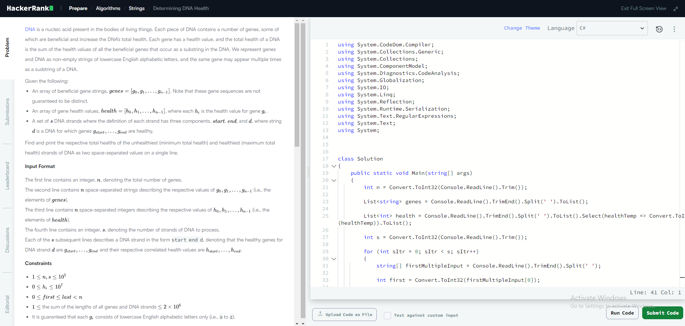
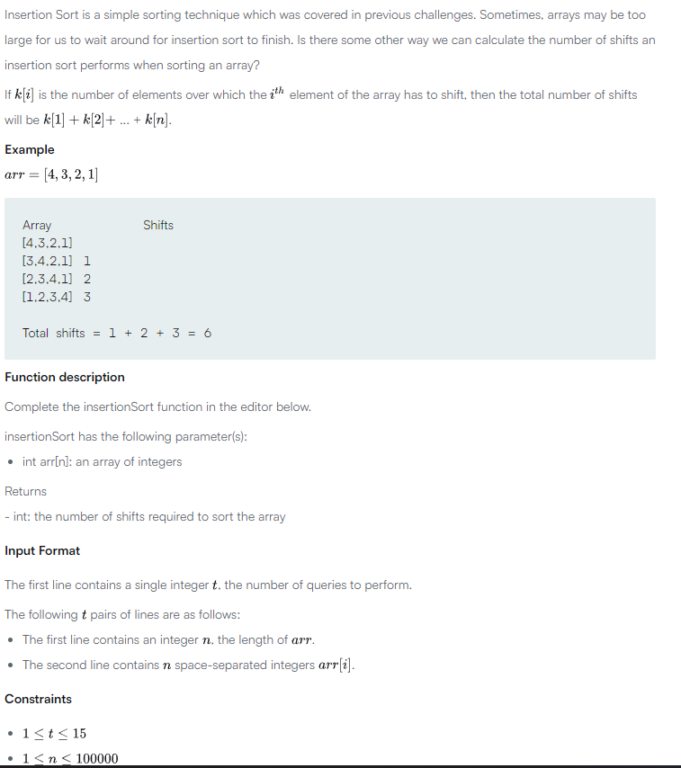

### Currently Running -> [CoBattles 2](https://www.hackerrank.com/contests/cobattles-1/)

## Table of Content
- [Introduction](#introduction)
- [CoBattles](#cobattles)
    - [Background](#background)
    - [Rules](#rules)
    - [Navigating the Platform](#navigating-the-platform)
- [Contests](#contests)
    - [CoBattles 1](#cobattles-1)

## Introduction
As programmers, we can make use of coding challenges to improve our coding and problem-solving skills, these challenges introduce us to abstract problems that often require us to think beyond the repetitive code we write on a day-to-day basis. 

Coding challenges are a great way to not only practice your problem-solving skills, but also allow you to learn more about your programming language as you look for different ways to optimise your solutions and discover new techniques. 

Coding challenges are a key part of most hiring processes for technical roles, they will usually be part of the application phase where you might be required to complete a coding challenge to get to the next stage. 

Being good at coding challenges won’t only prepare you for the coding challenge part of the application process, but it will also give you the problem-solving practice that you need to perfect your approach before getting into a technical interview where you would need to showcase your ability to take a problem that you haven’t see before and formulate a solution for it.

## CoBattles
CoBattles are a series of coding challenges that aim to get you in the groove of doing coding challenges, each week’s challenges will aim to test a certain aspect of your coding ability with a mixture of challenges that are similar to those found in coding interviews and other challenges that are there to push your problem-solving skills that bit further.

### Background
Each week on Monday, a new contest will start, the links can be found [here](#contests), you will need to sign up for the contest in order to participate.

#### Rules 
- Each contest will have a variable number of challenges
- You are not required to complete all of the challenges in a single seating
	- You can spread out when you do each challenge while the contest is running
- The time it takes to complete an INDIVIDUAL challenge may affect your final score
	- The timer for a specific challenge will start as soon as that challenge is opened
- The scoring for the contest will vary week to week, the contest page will highlight how the specific contest is being scored.

#### Navigating The Platform 
If it's your first time using a coding challenge tool, it might be intimidating and overwhelming at first, but it's important to stay calm and read through the instructions that are provided. There are however a few things that might not be clear, so let's try to clear them up.

When you get into a challenge, you will be faced with something similar to the image below.

If it's your first time ever doing a coding challenge, you will want to get familiar with the coding interface first before you take a look at the actual problem, once you've done a few coding challenges then everything will be more straightforward.

1. Change the programming language by clicking on the option on the top right of your screen 
2. There is a lot of code pre-written, look for the function with comments, these comments will let you know which functions to work with 
    - Most fo the function are for doing background operations, DO NOT TOUCH them
    - Read the comments and only edit the functions that you are directed to
3. Once your code is written, make sure that you test your code first 
    - Click the "Run Code" (Or run tests depending on the platform)
    - Make sure that your code is passing all of the tests before submitting

On the left side of the screen, you will find the questions section

- Make sure that you read and understand the problem before attempting to write the code 
- Look at the input that will be provided and the required output 
    - Your output has to be exact or your code will fail the tests.
- Look through the input and expected outputs in the examples provided
- Look at the constraints for the problem

## Contests

### CoBattles 1
[Ended](https://www.hackerrank.com/contests/cobattles/)

Top Submissions
- 👑 - william_hoggins
- 🥇 - dav_silvs
- 🥈 - alex_haider
- 🥉 - linavysnia
- 🏅 - mphilbert1

